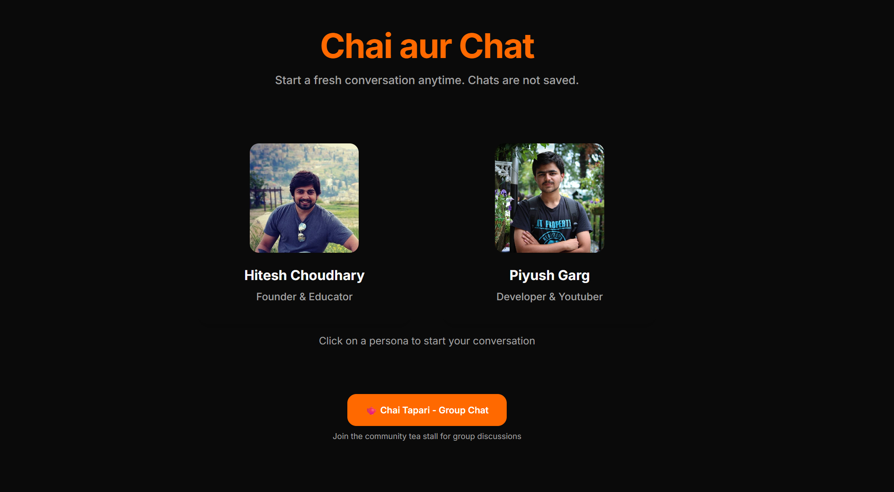

Of course. Here is a more detailed and comprehensive README.md file for your project. It includes placeholders for your live deployment link and a project screenshot, along with deeper explanations of the project's structure and configuration.

Just copy and paste the content below into a `README.md` file in the root of your project.

---

An advanced chat application that allows users to engage in dynamic conversations with AI-powered personas of renowned developers and educators, **Hitesh Choudhary** and **Piyush Garg**.

**[Visit the Live Demo](https://ai-persona-sable.vercel.app/)** 


_(Replace this with a screenshot of your application)_

## About The Project

This project was born from the idea of making mentorship and expert knowledge more accessible. By creating digital personas of well-respected figures in the tech community, we can simulate interactive learning and discussion. Users can ask questions, get feedback, or simply have a casual chat with an AI that embodies the expertise and communication style of their favorite mentors.

The application leverages the power of Large Language Models (LLMs) like **Google Gemini** and **OpenAI's GPT series** to create a fluid, context-aware, and engaging conversational experience.

## Key Features

- 👤 **One-on-One Chat**:

  - Select a persona (Hitesh or Piyush) for a direct conversation.
  - Receive a dynamic, AI-generated welcome message tailored to the persona.
  - Engage in a context-aware conversation where the AI remembers previous messages.

- ☕ **Group Chat ("Chai Tapari")**:

  - A unique community chat room where the user can interact with both Hitesh and Piyush AI personas at the same time.
  - The AI personas can respond to the user _and_ to each other, creating a lively and unpredictable group discussion.
  - The backend API intelligently orchestrates which persona replies next to keep the conversation flowing naturally.

- ⚙️ **Customizable Experience**:

  - Adjust the AI's **Temperature** setting to control response creativity, from conservative and factual to highly creative.
  - Switch between different **Conversation Modes** (e.g., Mentor, Feedback, Casual) to shape the AI's tone and purpose.

- ✨ **Modern & Responsive UI**:
  - A clean, intuitive, and aesthetically pleasing chat interface.
  - Built with Tailwind CSS for a fully responsive design that works on all screen sizes.
  - Includes user-friendly components like confirmation dialogs and settings panels.

## Tech Stack & Architecture

This project is built with a modern, full-stack TypeScript setup:

| Technology          | Role                                                                                                                                                                 |
| ------------------- | -------------------------------------------------------------------------------------------------------------------------------------------------------------------- |
| **Next.js**         | The core full-stack framework, utilizing the **App Router** for routing, Server Components, and API Routes.                                                          |
| **React**           | The UI library for building interactive components.                                                                                                                  |
| **TypeScript**      | Provides static typing for improved code quality, readability, and developer experience.                                                                             |
| **Tailwind CSS**    | A utility-first CSS framework for rapid and consistent UI development.                                                                                               |
| **LLM Integration** | The `openai` Node.js client is used as a compatible wrapper to connect to both **Google Gemini** and **OpenAI** endpoints, providing flexibility in model selection. |
| **Lucide React**    | A beautiful and consistent icon library.                                                                                                                             |

## Project Structure

The project follows the standard Next.js App Router structure:

```
/
├── app/
│   ├── api/
│   │   ├── generate/       # API for one-on-one chat
│   │   │   └── route.ts
│   │   ├── group-chat/     # API for the Chai Tapari group chat
│   │   │   └── route.ts
│   │   └── start-chat/     # API to generate the initial welcome message
│   │       └── route.ts
│   ├── chat/
│   │   ├── [persona]/      # Dynamic route for one-on-one chats
│   │   │   └── page.tsx
│   │   └── tapari/         # Route for the group chat page
│   │       └── page.tsx
│   └── layout.tsx          # Root layout
├── public/                 # Static assets (images, fonts, etc.)
│   └── screenshot.png
└── .env.local              # Environment variables (API Keys)
```

## Getting Started

Follow these instructions to get a local copy of the project up and running for development and testing.

### Prerequisites

- Node.js (v18.0 or later)
- A package manager like `npm`, `yarn`, or `pnpm`

### Installation & Setup

1.  **Clone the Repository:**

    ```sh
    git clone https://github.com/soynerd/ai-persona.git
    cd ai-persona-chat
    ```

2.  **Install Dependencies:**

    ```sh
    npm install
    ```

3.  **Set Up Environment Variables:**
    Create a new file named `.env.local` in the root of your project. Add your API key from Google AI Studio.

    ```.env.local
    GEMINI_API_KEY="YOUR_GOOGLE_GEMINI_API_KEY"
    ```

    _Note: The project is pre-configured to use the Gemini API endpoint. To use OpenAI, you would need to update the `baseURL` in the API routes and add your OpenAI key._

4.  **Run the Development Server:**
    ```sh
    npm run dev
    ```

The application will be available at **[http://localhost:3000](http://localhost:3000)**.

## Configuration & Customization

This project is designed to be easily customizable.

- **To change AI personas:** Modify the `personas` object in `/app/chat/[persona]/page.tsx` and the `onlineUsers` array in `/app/chat/tapari/page.tsx`.
- **To adjust AI behavior:** Edit the system prompts (`hitesh_sysPrompt`, `piyush_sysPrompt`) at the top of each API route file (`/app/api/.../route.ts`). These prompts are the primary drivers of the AI's personality.

## Deployment

The easiest way to deploy this Next.js application is with [Vercel](https://vercel.com/).

1.  Push your code to a Git repository (GitHub, GitLab, etc.).
2.  Import the repository into Vercel.
3.  Add your `GEMINI_API_KEY` as an environment variable in the Vercel project settings.
4.  Click **Deploy**. Vercel will automatically handle the build process.

## License

Distributed under the MIT License. See `LICENSE` for more information.

## Acknowledgments

- A big thank you to **Hitesh Choudhary** and **Piyush Garg** for their invaluable contributions to the developer community.
- The teams behind Next.js, OpenAI, and Google Gemini for their incredible tools.
